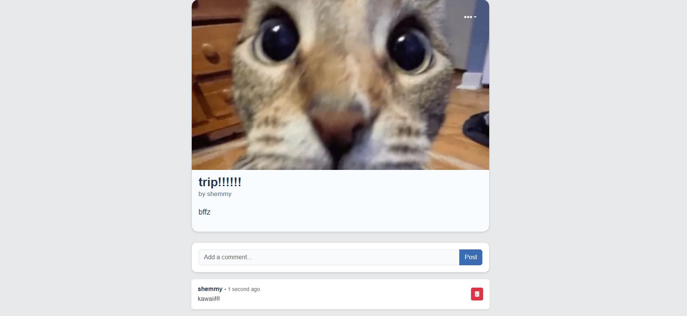

# 🌸 Blogtopia — A Simple & Clean Blogging Platform

<p align="center">
  
  
  
</p>

Blogtopia is a modern and minimal blogging platform built with **Laravel**.
It allows users to write posts, customize profiles, and enjoy a clean, distraction-free blogging experience.

---

## ✨ Features

- 📝 Create, edit & delete posts  
- 🔒 Public & private posts  
- 👤 User profiles (avatar, header, bio)  
- ❤️ Likes & interactions  
- 🔔 Notification system  
- 🖼️ Image uploads  
- 📱 Fully responsive  
- 📄 Pagination for posts  
- 🎨 Clean and simple UI  

---

## 🛠 Tech Stack

| Technology | Purpose |
|-----------|---------|
| **Laravel 11** | Backend framework |
| **Blade Templates** | Templating engine |
| **Bootstrap / Tailwind** | UI styling |
| **MySQL** | Database |
| **Laravel Auth** | User authentication |

---

## 🚀 Installation

### 1. Clone the Repository
```bash
git clone https://github.com/shemmyah/blogtopia.git
cd blogtopia
```
### 2. Install Dependencies
```bash
composer install
npm install
```
### 3. Build Frontend Assets
```bash
npm run build
```
### 4. Create Environment File
```bash
cp .env.example .env
php artisan key:generate
```
### 5. Configure Database in .env
```bash
DB_DATABASE=blogtopia
DB_USERNAME=root
DB_PASSWORD=
```
### 6. Run Migrations
```bash
php artisan migrate
```
### 7. Start the Application
```bash
php artisan serve
```

## 📸 Screenshots

<p align="center">
  
  
  
</p>

<p align="center">
  
  
  
</p>


